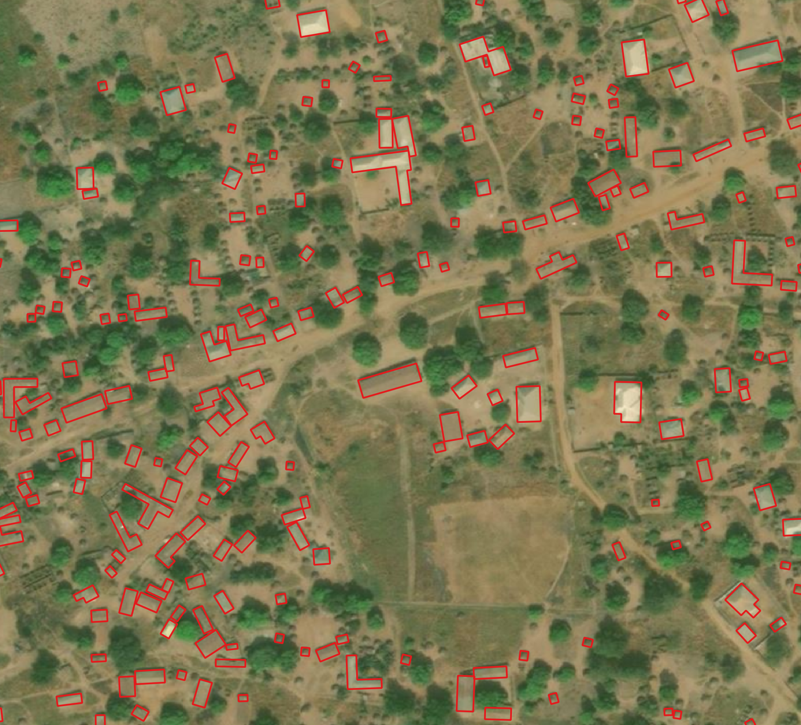
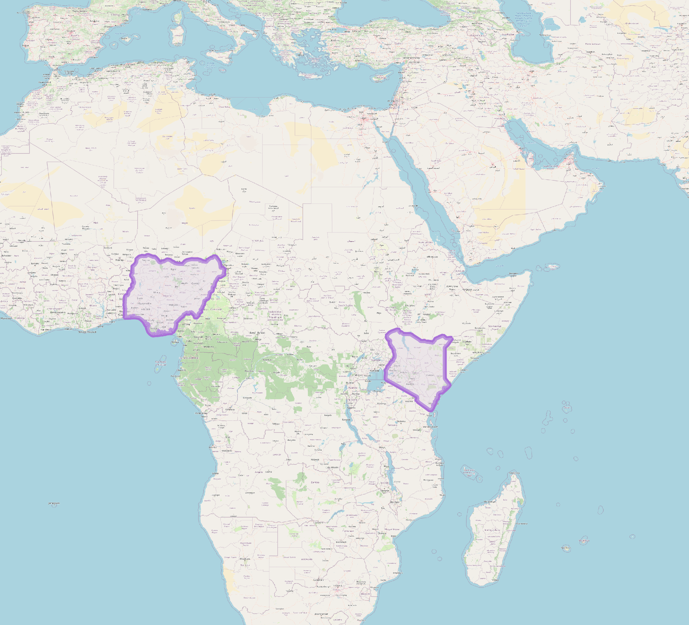

## Introduction

Bing Maps is releasing open building footprints Nigeria and Kenya. We have detected 50.5 million buildings from Maxar imagery collected between 2020 and 2021. The data is freely available for download and use under applicable license.

### Regions included 

## License
This data is licensed by Microsoft under the [Open Data Commons Open Database License (ODbL)](https://opendatacommons.org/licenses/odbl/).

## FAQ
### What does the data include?
50,516,194 building footprint polygon geometries located in Kenya and Nigeria in line-delimited GeoJSON format. You may download the data in GeoJSON format here:

| Location | Building Count | Link | Size (Compressed) |
| :---: | :---: | :---: | :---: |
| Nigeria | 35,767,509 | [Nigeria.geojsonl.zip](https://minedbuildings.blob.core.windows.net/africa/nigeria.geojsonl.zip) | 2.3GB |
| Kenya | 14,748,685 | [Kenya.geojsonl.zip](https://minedbuildings.blob.core.windows.net/africa/kenya.geojsonl.zip) | 984MB |

### What is the GeoJSON format?
GeoJSON is a format for encoding a variety of geographic data structures. 
For intensive documentation and tutorials, refer to [GeoJson blog](http://geojson.org/).

### Why is the data being released?
Microsoft has a continued interest in supporting a thriving OpenStreetMap ecosystem.

### Should we import the data into OpenStreetMap?
Maybe. Never overwrite the hard work of other contributors or blindly import data into OSM without first checking the local quality. While our metrics show that this data meets or exceeds the quality of hand-drawn building footprints, the data does vary in quality from place to place, between rural and urban, mountains and plains, and so on. Inspect quality locally and discuss an import plan with the community. Always follow the [OSM import community guidelines](https://wiki.openstreetmap.org/wiki/Import/Guidelines).

### Will the data be used or made available in larger OpenStreetMap ecosystem?
Yes. Currently Microsoft Open Buildings dataset is used in ml-enabler for task creation. You can try it out at [AI assisted Tasking Manager](https://tasks-assisted.hotosm.org/). The data will also be made available in Facebook [RapiD](https://mapwith.ai/rapid#background=Bing&disable_features=boundaries&map=2.00/0.0/0.0).

### How did we create the data?
The building extraction is done in two stages:
1.	Semantic Segmentation – Recognizing building pixels on an aerial image using deep neural networks (DNNs)
2.	Polygonization – Converting building pixel detections into polygons

#### Stage1: Semantic Segmentation

#### Stage 2: Polygonization

### Were there any modeling improvements used for this release? 
There were no changes in the model training process over previous releases. 

### Evaluation set metrics
The evaluation metrics are computed on the set of 2,500 building labels for Nigeria and 2,000 for Kenya.

Building match metrics on the evaluation set:

| Country | Precision | Recall |
| :---: | :---: | :---: |
| Kenya | 97.5% | 69.1% |
| Nigeria | 95.3% | 69.% |

We track following metrics to measure the quality of matched buildings in the evaluation set:
1. Intersection over Union – This is a standard metric measuring the overlap quality against the labels
2. Dominant angle rotation error – This measures the polygon rotation deviation

| Country | IoU | Rotation error [deg] |
| :---: | :---: |:---: |
|  Kenya | 65.9% | 3.9 |
|  Nigeria | 64.8% | 1.9 |

### False positive ratio in the corpus

We estimate 1.3-1.9% false positive ratio in 1,000 randomly sampled buildings from the entire output corpus.

### What is the vintage of this data?
Vintage of extracted building footprints depends on vintage of the underlying imagery. Underlying imagery is from Maxar between 2020 and 2021.

### How good is the data?
Our metrics show that in the vast majority of cases the quality is at least as good as hand digitized buildings in OpenStreetMap. It is not perfect, particularly in dense urban areas but it provides good recall in rural areas.

### What is the coordinate reference system?
EPSG: 4326

### Will there be more data coming for other geographies?
Maybe. This is a work in progress. Also, check out our other building releases!
* [US](https://github.com/microsoft/USBuildingFootprints)
* [Australia](https://github.com/microsoft/AustraliaBuildingFootprints)
* [Canada](https://github.com/microsoft/CanadianBuildingFootprints)
* [Uganda and Tanzania](https://github.com/microsoft/Uganda-Tanzania-Building-Footprints)
* [South America](https://github.com/microsoft/SouthAmericaBuildingFootprints)

 

## Contributing

This project welcomes contributions and suggestions.  Most contributions require you to agree to a
Contributor License Agreement (CLA) declaring that you have the right to, and actually do, grant us
the rights to use your contribution. For details, visit https://cla.microsoft.com.

When you submit a pull request, a CLA-bot will automatically determine whether you need to provide
a CLA and decorate the PR appropriately (e.g., label, comment). Simply follow the instructions
provided by the bot. You will only need to do this once across all repos using our CLA.

This project has adopted the [Microsoft Open Source Code of Conduct](https://opensource.microsoft.com/codeofconduct/).
For more information see the [Code of Conduct FAQ](https://opensource.microsoft.com/codeofconduct/faq/) or
contact [opencode@microsoft.com](mailto:opencode@microsoft.com) with any additional questions or comments.

## Legal Notices

Microsoft, Windows, Microsoft Azure and/or other Microsoft products and services referenced in the documentation
may be either trademarks or registered trademarks of Microsoft in the United States and/or other countries.
The licenses for this project do not grant you rights to use any Microsoft names, logos, or trademarks.
Microsoft's general trademark guidelines can be found [here](http://go.microsoft.com/fwlink/?LinkID=254653).

Privacy information can be found [here](https://privacy.microsoft.com/en-us/).

Microsoft and any contributors reserve all others rights, whether under their respective copyrights, patents,
or trademarks, whether by implication, estoppel or otherwise.
